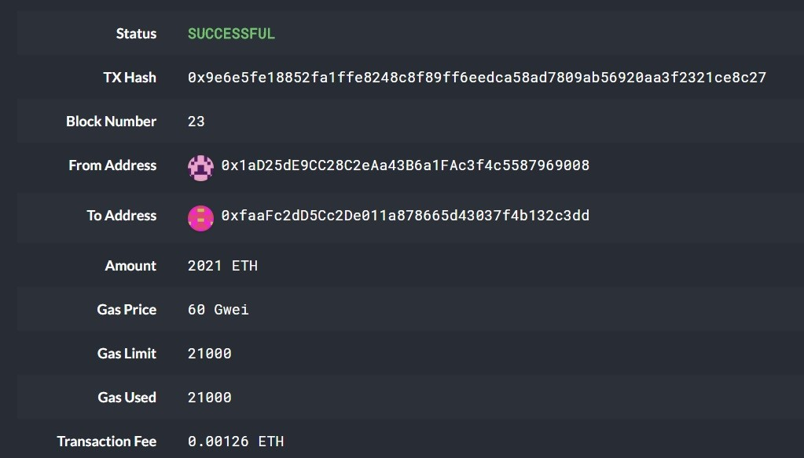
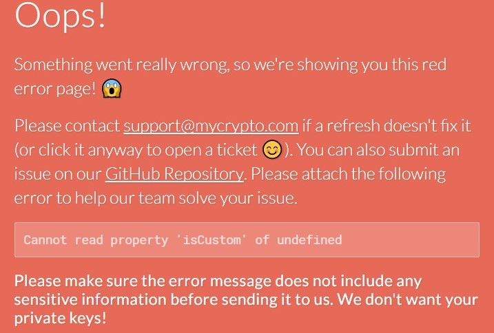

# Blockchain Homework
## ZBank's Proof of Authority Development Chain

A development chain, called zbanknet, has been created on Ethereum testnet. 
Puppeth utility was used to create genesis block with following attributes:
* blocktime = 15s
* chainID = 007
* `Clique (Proof of Authority)` consensus algorithm
* Node1 address: 0x1aD25dE9CC28C2eAa43B6a1FAc3f4c5587969008
* Node1 passwd: 1bank
* Node2 address: 0xfaaFc2dD5Cc2De011a878665d43037f4b132c3dd
* Node2 passwd: 2bank

## Starting up nodes
The contents of this repository can be cloned to local drive, after which the nodes can be started with two Bash terminals pointing to this cloned dir.
### Terminal1 for node1
* Run the following command in first terminal:
    *  ./geth --datadir node1 --unlock "1aD25dE9CC28C2eAa43B6a1FAc3f4c5587969008" --mine --rpc --allow-insecure-unlock
    * Enter the node1 password. If incorrect, command will state you have 2 more tries left!

### Terminal2 for node2
* **If on MAC**, run the following command in second terminal:
    *  ./geth --datadir node2 --unlock "faaFc2dD5Cc2De011a878665d43037f4b132c3dd" --mine --port 30304 --bootnodes "enode://578ab4051bf26472cdb8f15bbaefd8cc9e9ba39b59510b3ef269174b1d3412b24175b42be2b551583d12823ffc0a2162e7d22e8c88bfdc3fe3d3126337076c7d@127.0.0.1:30303" --ipcdisable --allow-insecure-unlock
    * Enter the node2 password. If incorrect, command will state you have 2 more tries left!

* **Else if on WIN10**, run the following command in second terminal:
    *  ./geth --datadir node2 --unlock "faaFc2dD5Cc2De011a878665d43037f4b132c3dd" --mine --port 30304 --bootnodes "enode://578ab4051bf26472cdb8f15bbaefd8cc9e9ba39b59510b3ef269174b1d3412b24175b42be2b551583d12823ffc0a2162e7d22e8c88bfdc3fe3d3126337076c7d@127.0.0.1:30303" --ipcdisable
    * Enter the node2 password. If incorrect, command will state you have 2 more tries left!

    
## Screenshot of successful test transaction

## Screenshot of MyCrypto crash (what to avoid)

