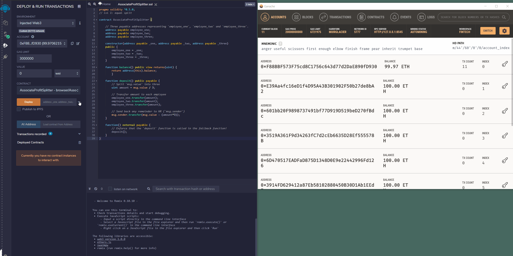

# Solidity Homework

## Associate Profit Splitter Contract

The purpose of this contract is to enable startup's HR department to efficiently:
- evenly split the startup's profit across three employees 
- return remaining profit resultant from simple integer division back to startup's HR department. (ie, the message sender.)

### Contract solidity code

* [`AssociateProfitSplitter.sol`](AssociateProfitSplitter.sol) 

### Deployment and transaction demo

