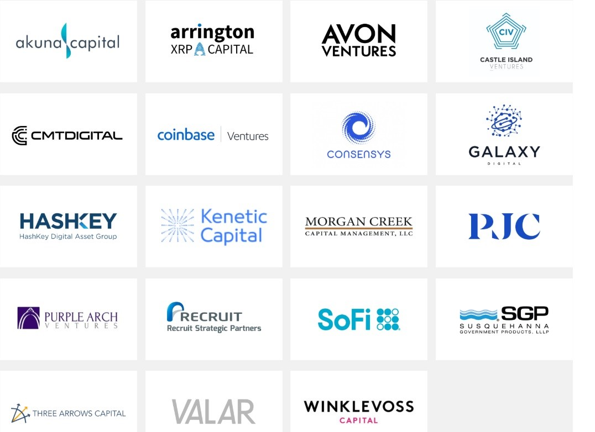

# Case Study of BlockFi

## Overview and Origin

BlockFi was officially founded in August 2017 by Zac Prince and Flori Marquez. 

Co-Founder, CEO Zac Prince:
* financed his college education through online poker
* held multiple lead sales and business development roles at online lending platforms

Co-Founder, VP of Operations Flori Marquez:
* managed alternative lending products at Bond Street, acquired by Goldman Sachs

Chief Risk Officer Rene Van Kesteren:
* 15 years experience at BAML ML Professional Clearing and Brokerage

BlockFi has completed 9 funding rounds for total funding of $158.7M with 6 lead investors:

## Business Activities:

The company's goal is to provide credit services to markets globally, even to those with limited access to simple, traditional financial products such as savings accounts. 

*__"BlockFi's vision is to bridge the worlds of traditional finance and blockchain technology to bring financial empowerment to clients on a global scale."__*

Presently, BlockFi provides three main sets of services for retail clients:
* Cryptocurrency savings accounts, earning up to 8% APY
* USD loans against crypto assets held within savings accounts
* Transaction-free cryptocurrency trading

According to company's website, their large retail client cryptocurrency balances drive operations. Yet in additon, BlockFi leverages enterprise-grade regulatory compliance to also offer traditional financial services to Institutions:
* Company loans for crypto-based businesses
* Bespoke short term loans for market makers and investment funds

They claim to pioneer a platform that combines regulatory complaince of traditional large financial institutions with the speed and scalability of modern software infrastructure encompassing multiple blockchains. 

BlockFi's perceived advantage vs competitors in the alternative lending, crypto currency space include:
* management's prior experience in risk/regulatory compliance and derivative trading
* founding team's prior experience in scaling alternative online lending products 
* strong backing from well known participants in traditional and cryptocurrency investment and financial industry 

As posted by a company Director of Engineering (Krzysztof Rutka) on Stackshare, BlockFi seems to utilize a fairly standard outside facing application stack of JavaScript on React microservices, utilizing PostgreSQL, running on AMZN's elastic compute.

Most certainly BlockFi has developed its own proprietary set of algorithms to manage risk across the various currencies, client balances and transactions, and market price volatility. As the crypto markets operate 24/7 with great speed and dynamic range, this author opines that these algorithms are likely implemented in compiled language for fastest execution.

## Landscape:

BlockFi operates in the online, alternative lender space. The major trends in this market have been to enable retail customer faster access to liquidity and loan products through efficient onboarding and maintenance software platforms. Some examples of competitors in the consumer lending area include:
* Credenc, founded in 2017. India based company focussing on student loans
* eLoan.co.il, founded in 2012, offers online lending in Israel
* Jimubox, online lending platform in China, founded in 2013

Within cryptocurrency space, BlockFi's competition is primarily from:
* Binance, started in 2017, EU crypto exchange also offering financial services
* Lendabit, P2P lending with crypto collateral utilizing BitGo for secure custodianship 
* Bitwala, utilizes Celsius DeFi loan network to offer interest bearing saving accounts 
* Constant, P2P lending with combo FDIC, Ethereum contracts, crypto collateralization 

## Results

For saving account clients the main concerns are interest rates paid and security of assets held within the accounts. BlockFi has continually upwards adjusted their interest rates paid to higher tier accounts -those with larger balances- to attract additional capital deposits. 

As of February 2020, BlockFi had over $650M USD in assets under management. 

## Recommendations

There are two areas where BlockFi could continue to improve and potentially gain further customer acceptance and assets under management:

1/ Provide an active trader friendly interface
* The recently added trading features are simple and rudimentary. BlockFi partners with Gemini exchange for cold storage and trading functionality. The online bank could potentially garner further traction by offering an API to enable more automated active trading features.
* BlockFi could start moving more towards an investment bank model where customers have a trading account and separate savings account (to separate risk management functions)

2/ Provide more "in-house" security features
* Existing customers must rely on third party 2FA functions from Google. 
* Development of and integration of an internal authentification process within BlockFi's recently released mobile app could reduce the potential attack surfaces for malicious account hackers

## Resources

[BlockFi web site](https://blockfi.com/)

[Crunchbase company overview](https://www.crunchbase.com/organization/blockfi-inc)

[Crunchbase CEO background](https://www.crunchbase.com/person/zac-prince)

[Some Competitors](https://craft.co/blockfi/competitors)

[User review](https://coincentral.com/blockfi-review/)
